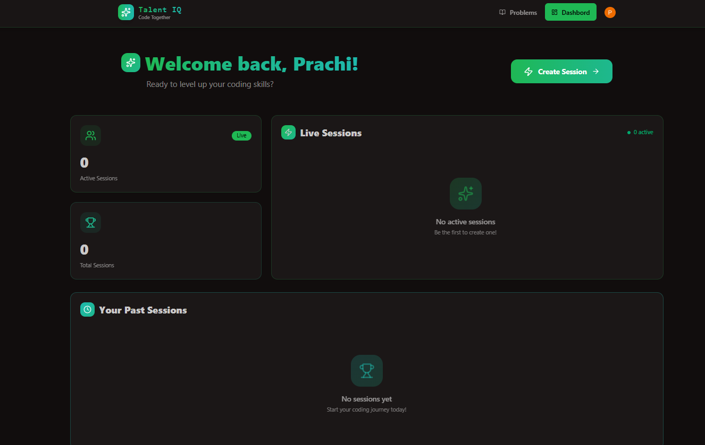
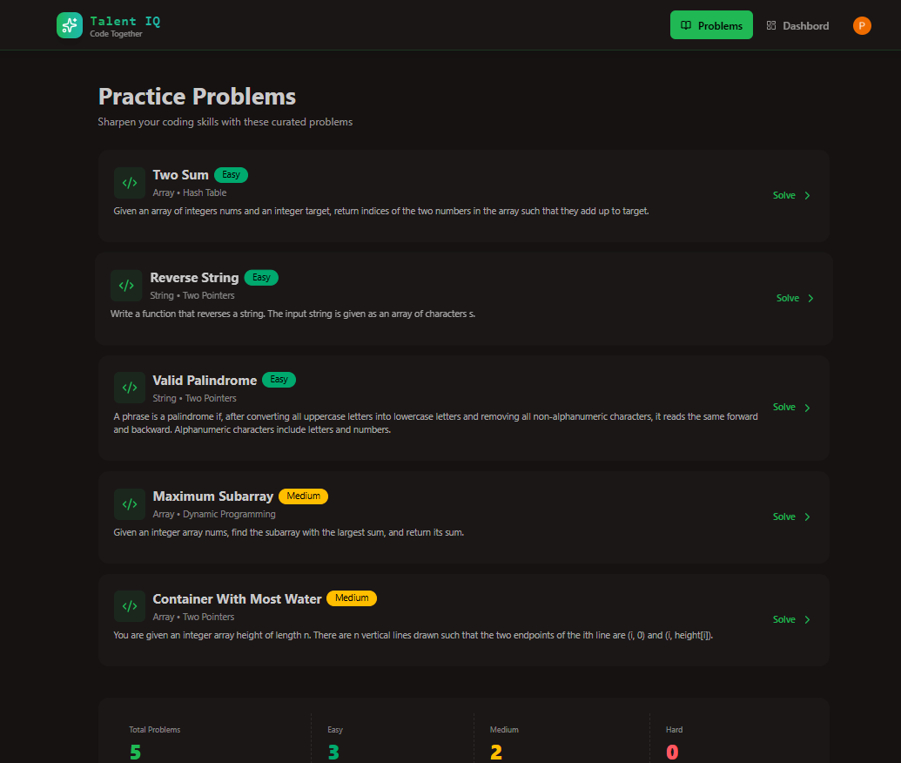
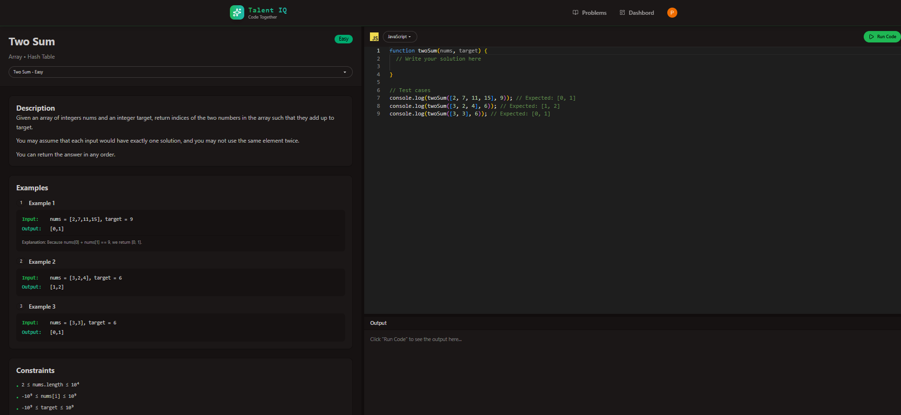

# Talent IQ 🎯

Talent IQ is a smart interview and talent evaluation platform designed to simplify and enhance the hiring process through technology-driven assessments and interactions.

---

## 🚀 Features
- User-friendly interface for interview management
- Real-time interaction and evaluation
- Secure authentication and role-based access
- Scalable and modular architecture
- Responsive UI for all devices

---

## 🛠️ Tech Stack
- Frontend: HTML, CSS, JavaScript
- Backend: Node.js, Express.js
- Database: MongoDB
- Version Control: Git & GitHub

---

## 📸 Screenshots




---

## ⚙️ Installation & Setup

```bash
# Clone the repository
git clone https://github.com/PrachiMalviya06/talent_IQ.git

# Move into project directory
cd talent-IQ-master

# Install dependencies
npm install

# Start the server
npm start
npm run dev
